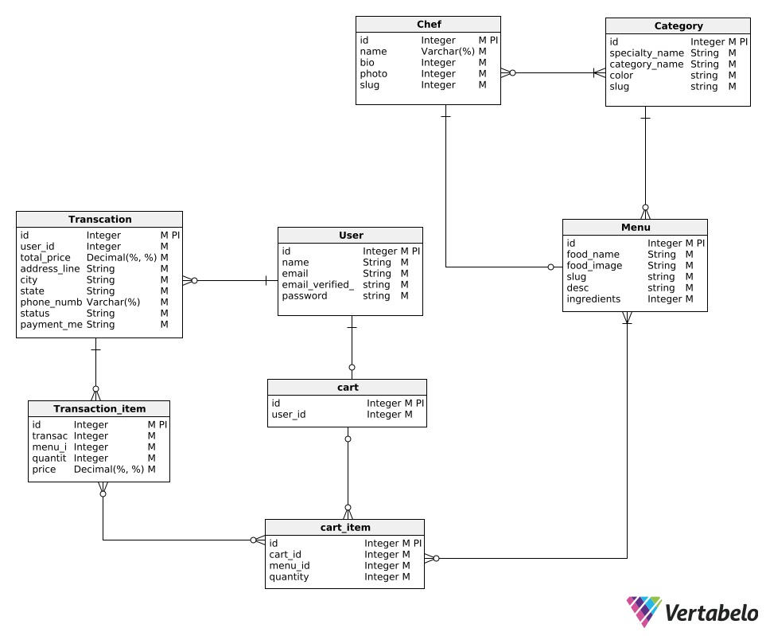

# 🌟 Laravel Final Project Plan - ArtisanEats

## 📝 Group Information
- *Group Number:* 34
- *Class:* Pemrograman Berbasis Kerangka Kerja (D)

## 👥 Group Members
| Name               | NRP         |
|--------------------|-------------|
| Rayssa Ravelia      | 5025211219  |
| Wan Sabrina         | 5025211023  |
| Syarifah Talitha    | 5025211175  |

## 🌍 Project Overview
For our final project in the Laravel framework course, we plan to develop a website called **ArtisanEats**, a Food Order Delivery Website. This website will allow customers to browse food menus and place delivery orders. The website will feature a clean and visually appealing green theme to represent freshness and sustainability.

## 📽️ Demo Video
Below is the demo video link that illustrates the key functionality of this project:  
[Watch the demo video here](https://youtu.be/z85R-rFig2Q)

## 🗂️ Conceptual Data Model
Below is the conceptual data model that outlines the structure and relationships of the data used in this project.

### 📊 Planned Models:

1. **Cart Model**:  
   This model will handle the shopping cart functionality, allowing users to add, update, and remove items from their cart. It will manage the relationship between users and the products they wish to purchase.

2. **Product Model**:  
   The Product model will represent individual food items available for order. It will include attributes such as name, description, price, and image URL. This model will be essential for displaying menu items to users.

3. **User Model**:  
   This model will manage user information for both customers and admins. It will handle user authentication, registration, and role-based access control, ensuring that users can log in and access features relevant to their role.

4. **Order Model**:  
   The Order model will track customer orders, including the items ordered, quantities, user details, and order status (e.g., pending, completed). This model will be critical for managing the ordering process and ensuring that orders are processed correctly.
   
---

## 🔄 Planned vs Actual Models Comparison:

| **Planned Model**    | **Actual Model**     | **Differences/Changes**  | **Reason for Change**                                     |
|----------------------|----------------------|--------------------------|-----------------------------------------------------------|
| **User**             | **User**             | Same                     | This model is crucial for managing customer data and authentication. |
| **Product**          | **Menu**             | Name changed from "Product" to "Menu" | To better align with the food delivery context, the term "Menu" was used to reflect the items available for order. |
| **Cart**             | **Cart**             | Same                     | Required for the shopping functionality, no changes.       |
| **Order**            | **Transaction**      | Name changed to "Transaction" | The model was renamed to "Transaction" to clarify its function, reflecting the overall process from order placement to payment. |
| **Chef**             | **Chef**             | New Model Added           | Initially not planned, but added to provide users with detailed chef profiles, enhancing the user experience. |
| **Category**         | **Category**         | New Model Added           | Added to organize the menu items into specific food categories for better browsing functionality. |
| **TransactionItem**  | **TransactionItem**  | New Model Added           | Tracks individual items within each transaction to record the details of each menu item ordered. |
| **CartItem**         | **CartItem**         | New Model Added           | Holds the items added to the cart before checkout. This was added to simplify managing multiple items in the user's cart. |

### 💡 Explanation of Changes:
1. **Menu vs Product**:  
   The name was changed from "Product" to "Menu" to better reflect the context of the application. Since the website deals with food items, "Menu" is a more intuitive term for users.

2. **Transaction vs Order**:  
   We replaced "Order" with "Transaction" to align with common e-commerce terminology and Laravel's standard practices. This also emphasizes the entire lifecycle of a transaction, from order placement to payment.

3. **New Models (Chef, Category, CartItem, TransactionItem)**:  
   These models were added as the project evolved to meet the application's needs. **Chef** and **Category** were added to provide more detailed functionality for browsing food items and highlighting the experts behind the dishes. **CartItem** and **TransactionItem** were added to efficiently manage multiple items in the cart and orders.

---

Here’s the updated section for the key features, including a comparison between the planned and actual key features:

---

## 🛠️ Key Features (Planned vs Actual)

### Key Features (Planned):
1. **Menu Display**:  
   Customers will be able to view a list of available food items, including details such as price, description, and images.

2. **Order System**:  
   Customers can add food items to their cart, adjust quantities, and place orders for delivery.

3. **User Authentication**:  
   Separate login systems for customers and admins. Admins will manage the menu, view orders, and update order statuses.

4. **Responsive Design**:  
   The website will be designed to work seamlessly on both mobile devices and desktops.

---

### Key Features (Actual):

1. **Menu Display**:  
   The menu display remains the same as planned. Customers can browse a list of available food items, view prices, descriptions, and images. Categories and chefs are also integrated into the menu display to enhance navigation.

2. **Order through Cart**:  
   Users can add food items to their cart, adjust quantities, and place orders for delivery. Instead of a direct order system, the **Cart** model was implemented to manage items before finalizing orders. 

3. **User Authentication (Customer Only)**:  
   User authentication is implemented, but **only for customers**. The admin system for managing the menu, orders, and statuses has not been implemented in this version, focusing more on the customer-facing features.

4. **Responsive Design**:  
   The website is designed to work seamlessly on both mobile devices and desktops, as planned, providing a smooth user experience across platforms.

5. **Chef Page** (New Addition):  
   A dedicated **Chef Page** was added where users can view the details of chefs who prepared the dishes. This feature wasn't part of the initial plan but was added to enhance user interaction and provide more information about the experts behind the food.

---

### 🔄 Planned vs Actual Key Features Comparison:

| **Planned Feature**       | **Actual Feature**          | **Differences/Changes**                      | **Reason for Change**                                       |
|---------------------------|-----------------------------|----------------------------------------------|-------------------------------------------------------------|
| **Menu Display**           | **Menu Display**            | Same as planned                              | The initial feature of displaying menu items remains the same. |
| **Order System**           | **Order through Cart**       | Shift to a Cart-based ordering system        | A Cart model was implemented to allow users to manage items before finalizing orders, offering more flexibility. |
| **User Authentication (Admin + Customer)** | **User Authentication (Customer Only)** | Admin authentication was not implemented   | Focus shifted to building a customer-only system for simplicity and scope reasons. |
| **Responsive Design**      | **Responsive Design**       | Same as planned                              | The application is designed for mobile and desktop compatibility as planned. |
| **Chef Page** (Not Planned) | **Chef Page** (New Addition) | New feature added for chef profiles         | This was added to improve user engagement by showcasing chefs, which wasn't in the initial scope but enhances the experience. |

## 🚀 Workflow:

1. **User Browses Menu**:
   - Users can explore available menu items categorized by food type (e.g., appetizers, entrees). Detailed information such as price, description, and images is provided.

2. **Add to Cart**:
   - Users add items to their cart (`CartItem`) with the option to adjust quantities. The cart (`Cart`) tracks the user’s selected items.

3. **Checkout Process**:
   - Users can view their cart and proceed to checkout, where they provide their shipping address and select a payment method. This information is stored in the `Transaction` model.

4. **Payment and Confirmation**:
   - After submitting the payment method and confirming the order, the system generates a `Transaction`, storing all the associated transaction items (`TransactionItem`).

5. **Order History**:
   - Users can view their past orders by accessing the `Transaction` model. Each transaction includes details of the items purchased and their statuses (pending, completed, etc.).

6. **Update Payment Method**:
   - If a user’s transaction is marked as pending, they can return to the transaction and update the payment method.

## 💻 Web Pages
Below describes the key pages and functionalities of the web application.

- [**Authentication**](#authentication):
  - [Login Page](#login-page)
  - [Register Page](#register-page)
- [**Homepage**](#homepage):
  - [Hero Section](#hero-section)
  - [About Us Section](#about-us-section)
  - [Contact Us Section](#contact-us-section)
- [**Menu**](#menu):
  - [Menu Page](#menu-page)
  - [Category Page](#category-page)
  - [Menu Detail Page](#menu-detail-page)
- [**Order**](#order):
  - [Cart Page](#cart-page)
  - [Order/Checkout Page](#ordercheckout-page)
  - [Order Summary/Payment Page](#order-summarypayment-page)
  - [Order History Page](#order-history-page)
- [**Chef**](#chef):
  - [Chef Page](#chef-page)
  - [Chef Detail Page](#chef-detail-page)
- [**Profile**](#profile):
  - [Profile Settings Page](#profile-settings-page)

### **Authentication:**

1. **Login Page:**

   
   - The login page allows registered users to log into their accounts. 
   - It features fields for entering an email address and password. 
   - There's also an option to remember the user by using a "Remember Me" checkbox. 
   - If a user forgets their password, they can click on the "Forgot your password?" link to reset it.
   - Users who don’t have an account can navigate to the registration page by clicking the "Register here" link.
  
2. **Register Page:**

   
   - The register page is where new users can create an account.
   - Users must provide their name, email, password, and confirm the password before clicking the "Register" button.
   - The page also has a link for existing users to navigate to the login page if they already have an account. 

### **Homepage:**

1. **Hero Section:**

   
   - The hero section showcases the main offer of Artisan Eats, highlighting its services for gourmet food delivery.
   - It features a prominent headline: *"Experience the Finest Cuisine with Artisan Eats"*, along with a short description about the service.
   - Users can click the "Browse Menu" button to explore available dishes.

2. **About Us Section:**

   
   - The About Us section provides information about the company’s mission and values.
   - It emphasizes the use of fresh, locally-sourced ingredients to ensure the best quality meals.
   - There's a "Contact Us" button for users to reach out for further information.

3. **Contact Us Section:**

   
   - This section provides a form for users to directly contact Artisan Eats.
   - It includes fields for name, email, and a message, as well as key contact details such as address, phone number, and email. 
   - The "Send Message" button allows users to submit their inquiries or messages easily.

### **Menu:**

1. **Menu Page:**

   
   - The Menu Page showcases a curated list of available dishes categorized by type.
   - Users can easily browse and add items to their cart from this page.
  
   
   - Each dish is displayed with an image, name, price, and category.
   - There is also an option to view more details or directly add the dish to the cart.

2. **Category Page:**

   
   - The Category Page groups dishes by specific types such as appetizers, entrees, desserts, and more.
   - Users can explore items by category and view all relevant dishes for their selection.

3. **Menu Detail Page:**

   
   - This page provides detailed information about a specific dish.
   - Users can see the chef responsible for the dish, the list of ingredients, and the option to adjust the quantity before adding the item to their cart.

### **Order:**

1. **Cart Page:**

   
   
   - The cart page displays a list of the items the user has added. 
   - Users can modify the quantity or remove items from the cart.
   - An order summary on the right provides details on the original price, delivery cost, and total price.
   - On the checkout page, users input their shipping address and select their payment method. 
   - The page shows the total cost of the order and provides options like cash on delivery or digital payment methods.
   - Users can click the "Continue to Order" button to finalize their order.

2. **Order Summary/Payment Page:**

   
   
   - This page confirms the details of the order and includes the final shipping address, payment method, and total price.
   - Once the payment is processed, a "Payment Successful" message is displayed, confirming the order has been placed.

3. **Order History Page:**

   
   - The order history page lists all completed orders by the user.
   - It displays details such as order number, order date, dishes purchased, and the total cost.
   - Users can expand or collapse order details to see which dishes were part of each order and the respective chefs.

### **Chef:**

1. **Chef Page:**

   
   - The chef page presents a list of all the chefs working for the restaurant. 
   - Each chef's profile includes their name and specialty.
   - The page includes a filter option for users to browse chefs based on their specialty, such as soup, dessert, etc.
   - Pagination is available for users to navigate through multiple pages of chefs.

2. **Chef Categories:**

   
   - This page showcases chefs filtered based on their expertise in specific categories, such as soup, pasta, or desserts.
   - Users can select a category from the dropdown, and the page will update to show only the chefs specializing in that category.

3. **Chef Detail Page:**

   
   - The chef detail page highlights the full profile of an individual chef.
   - It includes their biography, their culinary journey, and the specialties they are known for.
   - Signature dishes created by the chef are also listed at the bottom of the page.

### **Profile:**

1. **Profile Settings Page:**

   
   - This section allows users to update their profile information, including their name, email, and profile photo. Users can upload a new photo by selecting a file and saving the changes.

   
   - Additionally, users can update their password by providing their current password, a new password, and confirming it. There is also an option to permanently delete their account, with a warning to download any important data before proceeding.

